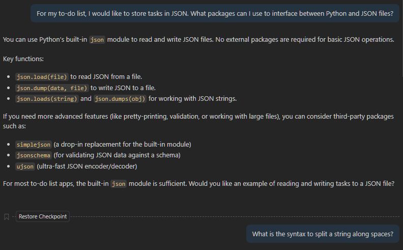
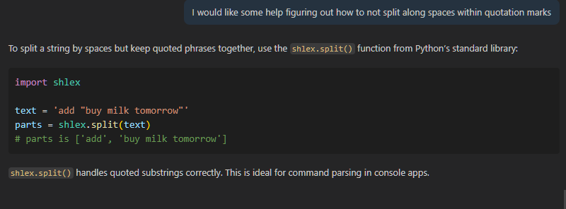
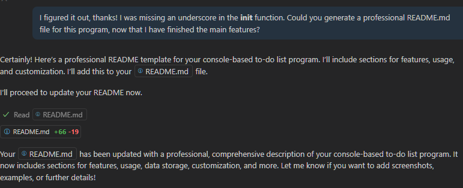

A. I asked Copilot to help with some initial figuring out. I asked it how I could take strings from the `input()` function and call matching functions. Though I could have searched it myself, I also asked it how I could have my code interact with JSON files for data persistence. Perhaps the most useful of my prompts was asking, in a rather roundabout way, how I could get shell-like inputs for the program. I asked it how to "not split along spaces within quotation marks" and it responded with the `shlex` package, which was precisely what I needed after a bit of further research.

Perhaps the most useful feature was the code completions, which streamlined a bunch of copy-pasting as well as filling in some of the blocks of code from the responses to my prompts. Whenever I came upon something with which I was unfamiliar (such as f-strings), I would research it to ensure it was right and learn to use the feature myself!
Code completions also offered some really excellent code comments, though sometimes it insisted a feature existed that was nowhere in the code.

In my prompts, I tried to politely ask for assistance and explain what I needed in the most precise way possible, explaining the pieces I already had in place and asking for a few more pieces (usually packages, advanced syntax, etc.). The politeness is a trick that I had heard improves results, but it also never hurts to be polite :)

B. As I knew more how my program was working precisely, I ended up just not prompting. I knew what I was doing, and was using code completions to streamline basic and/or repeated pieces of code. AI had served its purpose early on in helping to figure out some foundational elements, but I elected to lean more on my own knowledge and understanding once that foundation was laid.

C. I was surprised by the code completions. They are a really nice feature that matches what I want reasonably often, though usually with some tweaking. The ability for the completions to quickly adapt to precedent within the code was also impressive

D. Before today, I had not known that AI could operate so fast. My experience had been rather limited, with a bit of time playing about with ChatGPT. Github's integration surprised me with its speed.

E. If I had to build this again, I might store the tasks differently to allow for names to be used in addition to the ID numbers. It's possible to fetch the names within the code, but it requires a ridiculous amount of indexing that I did not feel like doing in the encouraged two-hour limit on programming this.